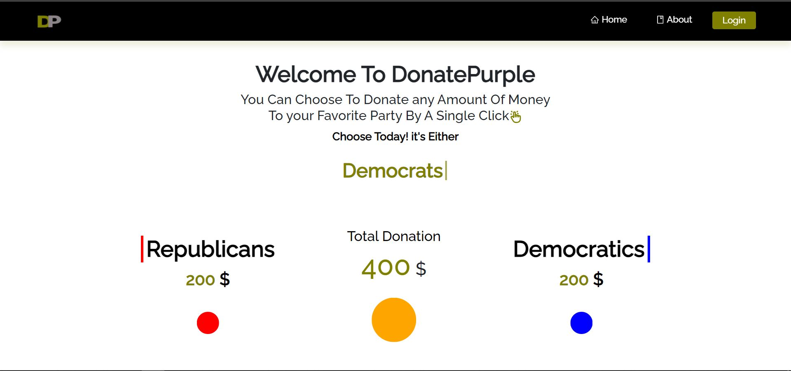

<h2 align="center">
  Donate Purple 
</h2>

  

 

 &nbsp;

## Built With

This project was built using these technologies.

- React.js
- Node.js

## Features

**📱 Fully Responsive**

## Getting Started

Clone down this repository. You will need `node.js` and `git` installed globally on your machine.

## 🛠 Installation and Setup Instructions

1. Installation: `npm install`

2. In the project directory, you can run: `npm start`

